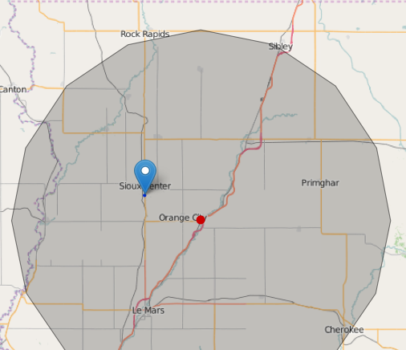

MySQL Stored Geo Functions
==========================

This is a small collection of MySQL stored functions which operate on spatial fields and which
may be useful filling in gaps in the built-in functionality. 

Order of preference should probably be: 

 1. Using a MySQL version with built-in spatial functions 
 2. Using a library like [MySQL-Spatial-UDF](https://github.com/krandalf75/MySQL-Spatial-UDF)
 3. Using stored functions

Using a different MySQL version or User Defined Functions (UDF), which require 
compiling code and installing libraries, may not always be feasible for 
distributed software. For such use cases, you might need stored functions like these.

These functions work with Points in lat long (EPSG:4326) format since they're intended to 
work with GeoJSON and web maps. 

What's Included
---------------

 * Buffering -- buffer_point.sql

	Buffer points in lat,long format by a certain distance. The _m and _mi versions assume
	that the distance is in meters or miles respectively. If you want to use a custom radius
	for the earth, you can use wp_buffer_point_real.

	These buffer functions return polygons, not actual circles. You can determine how many
	points the polygon contains with the segments argument. PostGIS defaults to 32.

	- wp_buffer_point_m(p POINT, radius FLOAT, segments INT) RETURNS POLYGON
	- wp_buffer_point_mi(p POINT, radius FLOAT, segments INT) RETURNS POLYGON
	- wp_buffer_point_real(p POINT, radius FLOAT, segments INT, eradius INTEGER) RETURNS POLYGON

 * Distance -- distance_point.sql 

	Determine the great-circle distance between two points using the Haversine formula. 

	Similar to the buffering functions above, the _m and _mi formulas return distances in meters and 
	miles respectively.

    - wp_distance_point_m(p1 POINT, p2 POINT) RETURNS FLOAT
    - wp_distance_point_mi(p1 POINT, p2 POINT) RETURNS FLOAT 
    - wp_distance_point_real(p1 POINT, p2 POINT, radius FLOAT) RETURNS FLOAT

 * Point / Bearing / Distnce functions -- point_bearing_distance.sql

	Given a starting Point, a bearing and a distance (in meters for _m, in miles for _mi) return a LineString
	object. 

    - wp_point_bearing_distance_to_line_m(p POINT, bearing FLOAT, distance FLOAT) RETURNS LINESTRING
    - wp_point_bearing_distance_to_line_mi(p POINT, bearing FLOAT, distance FLOAT) RETURNS LINESTRING
    - wp_point_bearing_distance_to_line(p POINT, bearing FLOAT, distance FLOAT, eradius INTEGER) RETURNS LINESTRING

	Given a starting Point, a bearing, distance and radius of the earth (in the same units as distance) calculate the
	latitude and longitude of the end point. The coordinates are returned as a space separated string, suitable for 
	appending to a Well Known Text (WKT) geometry definition.

    - wp_point_bearing_distance_coord_pair(p POINT, bearing FLOAT, distance FLOAT, eradius INTEGER) RETURNS VARCHAR(50)

Installation
------------

Run each of the .sql scripts in your preferred SQL client. You will need to do
this for each database where you want these functions to be available. 

You could optionally create a specific schema just for the spatial functions and 
store them there. See [this StackOverflow thread](http://dba.stackexchange.com/questions/50678/mysql-possibility-to-create-global-routines-stored-procedures-and-or-functions)
for more details.

Screenshots
-----------

Here's a sample screenshot of a point having been buffered with an 8 point polygon. 

 
